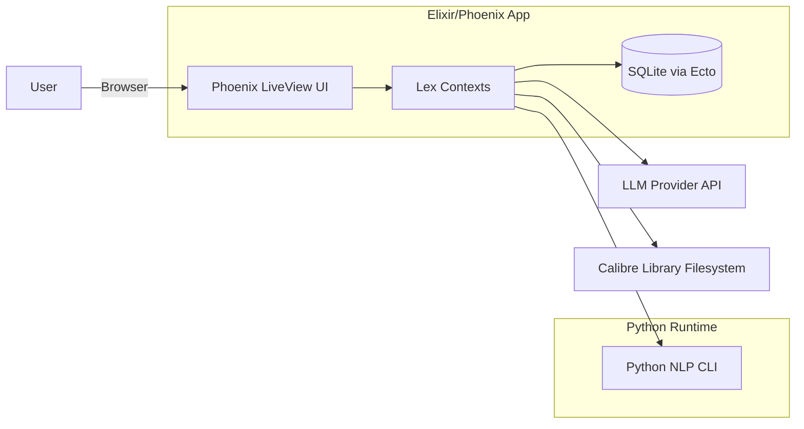
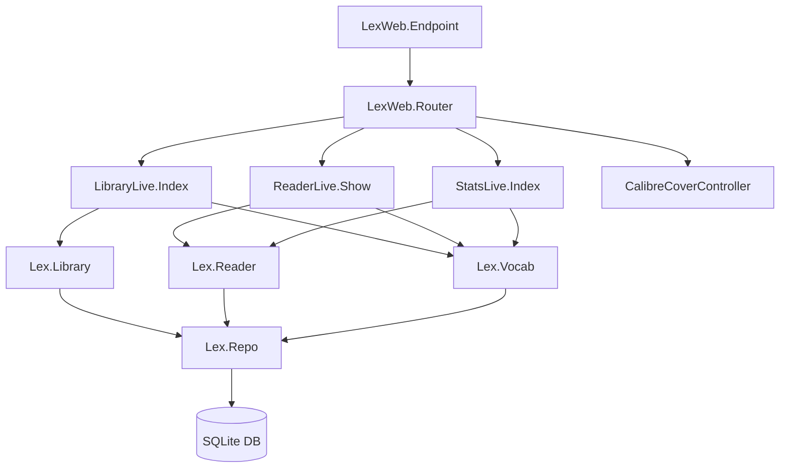
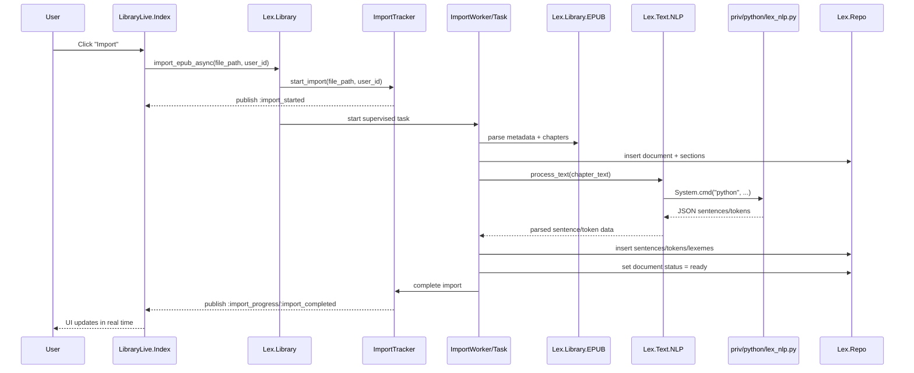
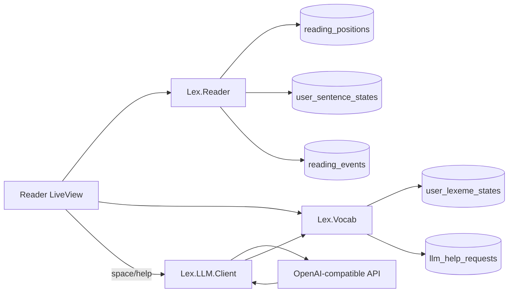
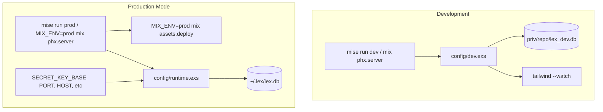
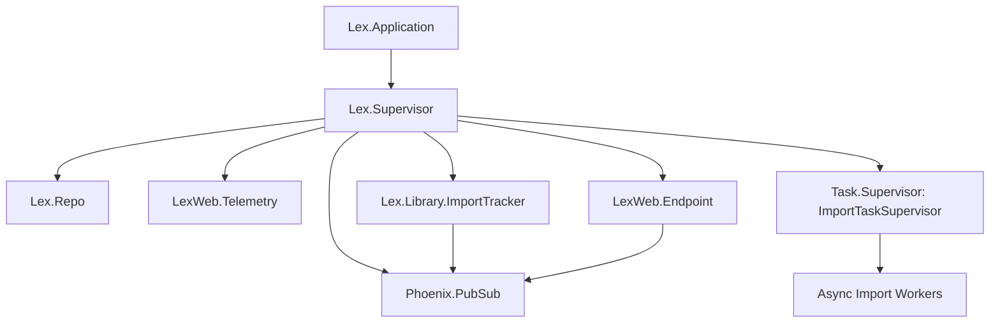

# Lex Architecture Diagrams

This document provides Mermaid diagrams for the Lex application architecture.

## 1) System Context

## 2) Phoenix + Domain Module Layout

## 3) EPUB Import + NLP Processing Pipeline

## 4) Reading + Vocabulary State Flow

## 5) Runtime Configuration and Environments

## 6) Supervision Tree (Simplified)

